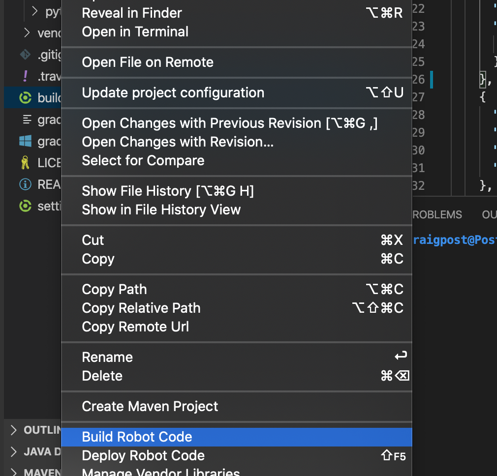
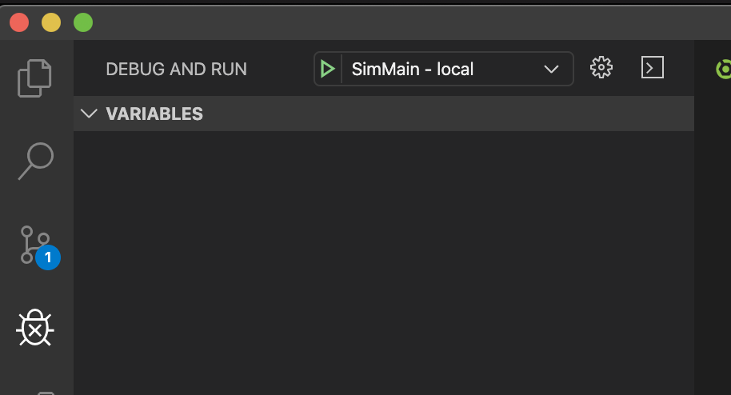
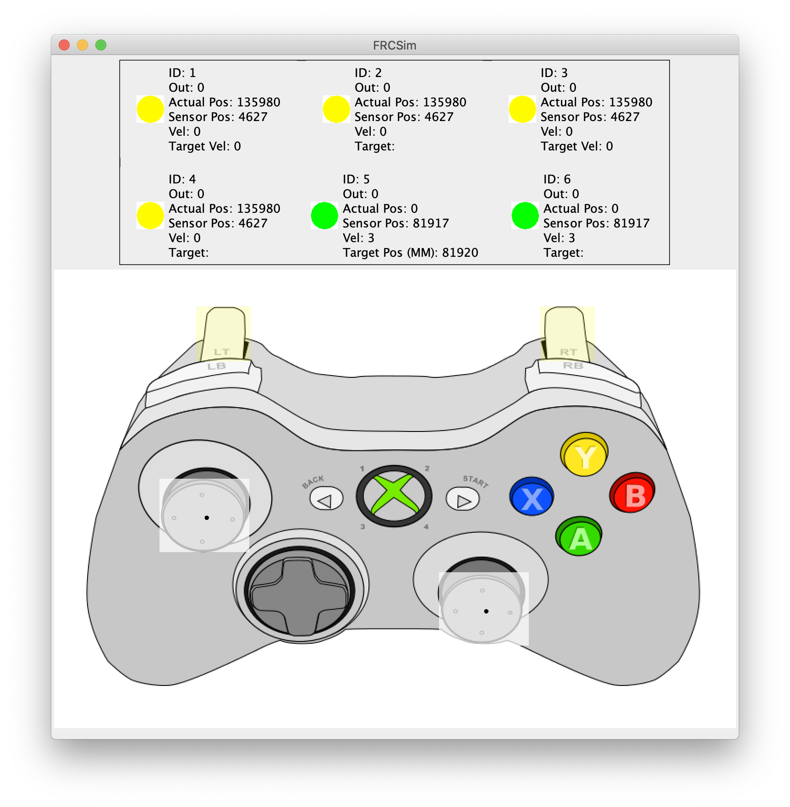

# FRCSim - A pure java simulator for FRC robots
The purpose of this project is to provide an easy to use First Robotics robot simulator. The simulator 
overrides the various HAL JNI classes used by the WPI libraries to communicate with the hardware and 
network. 

This project is in very early stages and is not currently released anywhere. It contains these modules:

* / - The root module containing a teaching robot for students to modify
* /simulator - module with the java based simulator
* /simulator/UnitySim - A unity based simulator that uses GRPC to talk to a java robot
* /simulator/UnitySimProtobuf - A simple C# project to build protobuf files for unity
* /mentor-bot - used by me, the mentor, because mentors need to learn to robot as well

## Configure Your Robot
To configure a robot to use the simulator, add a couple lines to your build.gradle:

### build.gradle changes 
First update the repositories {} section to include this hacky github maven repo
```gradle
repositories {
    // ...
    // other maven stuff, like mavenCentral()

    maven {
        // this repo contains the FRCSim
        url 'https://raw.githubusercontent.com/cpostbitbuckets/maven_repo/master'
    }
}
```

Next, update the dependencies section to include a runtime dependency on FRCSim:
```gradle

dependencies {
... other dependencies
    // ADD THIS DEPENDENCY
    // we only use this project at runtime when doing simulations
    runtimeOnly "org.bitbuckets:simulator:2020.1.2-SNAPSHOT"

    // If you have Talon motors, use this dependency as well
    runtimeOnly "org.bitbuckets:simulator-ctre:2020.1.2-SNAPSHOT"

    // If you have Spark motors, use this dependency as well
    runtimeOnly "org.bitbuckets:simulator-rev:2020.1.2-SNAPSHOT"

}
```

**Note**: Make sure you have the nativeDesktopZip dependency and includeDesktopSupport to true. This will 
ensure you can use shuffleboard and outline viewer to view any network table entries

### vscode launch.json changes
Finally, you'll need to update your launch.json to add an additional simulator configuration:

```json
    {
      "type": "java",
      "name": "SimMain - local",
      "request": "launch",
      "mainClass": "frc.robot.simulator.SimMain",
      "vmArgs": "-Djava.library.path=build/tmp/jniExtractDir",
      "env": {
        "DYLD_LIBRARY_PATH": "build/tmp/jniExtractDir"
      }
    }
```

### Build it and Test it
Use vs code to build the robot (and extract the network table native libraries into your build/ dir). 



Select the debug view and the newly created `SimMain - local` configuration, and click play.



**Note** You may have to run it twice. The first time it can't load native libraries, for some reason. I haven't 
figured that out yet.

You should see some hideous UI like this:


